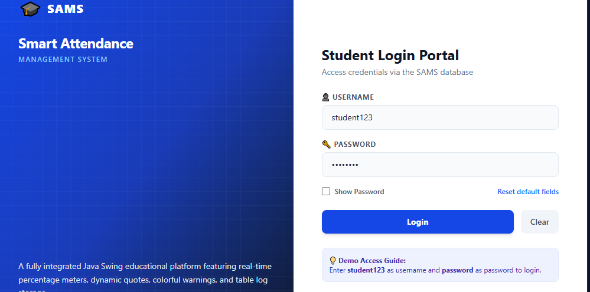
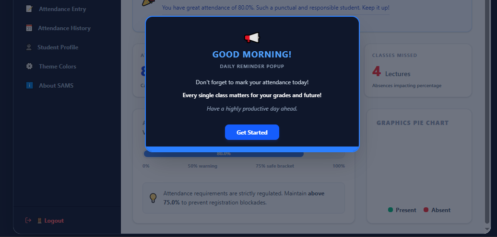
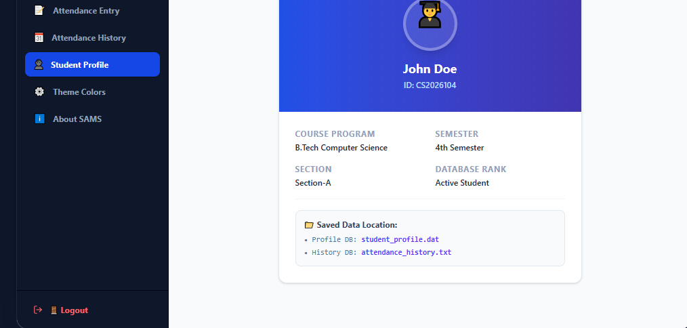
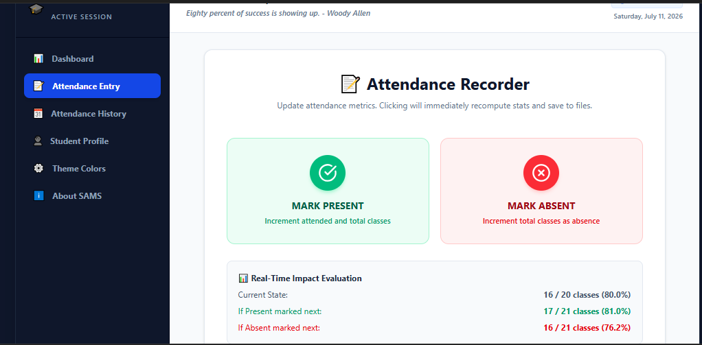
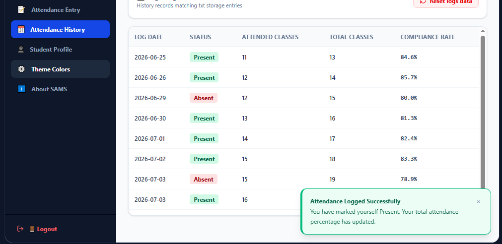
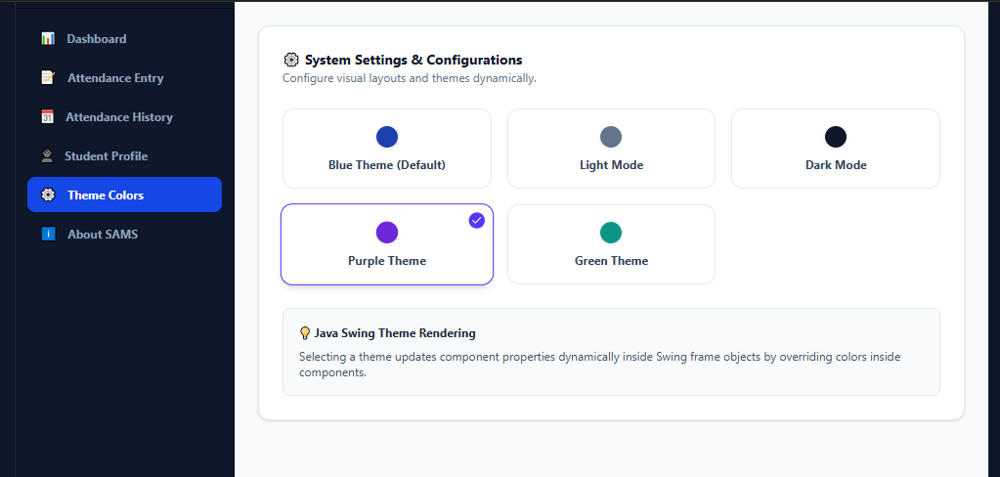

# 📚 Smart Attendance Management System

A Java-based Smart Attendance Management System developed to simplify and automate student attendance management. The application enables users to manage student records, mark attendance, view attendance history, and generate reports efficiently through an intuitive interface.

---

# 📸 Project Screenshots

## Login Screen


## Dashboard


## Student Management


## Mark Attendance


## Attendance Report


## Themes

---

# ✨ Features

- Secure Login System
- Student Registration
- Manage Student Records
- Mark Daily Attendance
- Update Attendance Records
- Search Student Information
- View Attendance History
- Attendance Report Generation
- User-Friendly Interface

---

# 🛠️ Technologies Used

- Java
- Java Swing
- MySQL
- JDBC
- VS Code

---

# 📂 Project Structure

```text
Smart-Attendance-Management-System/
│
├── src/
├── screenshots/
├── README.md
├── .gitignore
└── lib/
```

---

# 🚀 Installation & Usage

1. Clone this repository.
2. Open the project in VS Code or any Java IDE.
3. Configure the MySQL database.
4. Run the project.
5. Start managing student attendance.

---

# 🎯 Project Objectives

- Automate the attendance management process.
- Reduce manual paperwork.
- Improve accuracy in attendance records.
- Store and retrieve student data efficiently.
- Provide a simple and organized interface for users.

---

# 📈 Future Enhancements

- QR Code Attendance
- Face Recognition Attendance
- RFID-Based Attendance
- Email Notifications
- Attendance Analytics Dashboard
- Export Reports to PDF & Excel
- Cloud Database Integration

---

# 📚 Learning Outcomes

This project helped in understanding:

- Object-Oriented Programming (OOP)
- Java Swing GUI Development
- JDBC Connectivity
- MySQL Database Management
- CRUD Operations
- Exception Handling
- Database Design

---

# 👩‍💻 Author

**Deepa Rajput**

- M.Tech (Computer Science & Engineering)
- Java & Python Trainer
- Passionate Java Developer

---

## ⭐ If you like this project, don't forget to Star ⭐ this repository.
